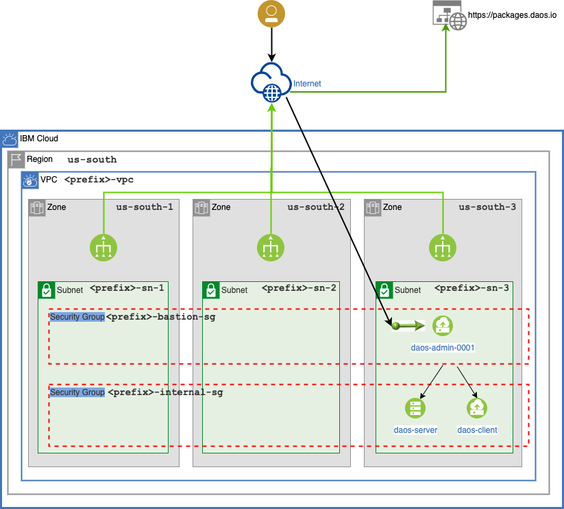

# DAOS Cluster in a new VPC

- [Overview](#overview)
  - [VPC](#vpc)
  - [DAOS Storage](#daos-storage)
- [Prerequisites](#prerequisites)
- [Deploy the VPC and DAOS Cluster](#deploy-the-vpc-and-daos-cluster)
  - [Terraform](#terraform)
  - [cloud-init and Ansible](#cloud-init-and-ansible)
- [Use the DAOS Cluster](#use-the-daos-cluster)
  - [Log into the DAOS Admin instance (bastion)](#log-into-the-daos-admin-instance-bastion)
  - [Check the status of the DAOS cluster](#check-the-status-of-the-daos-cluster)
  - [Check storage usage](#check-storage-usage)
  - [Check the pools](#check-the-pools)
  - [Create a container](#create-a-container)
  - [Mount the container](#mount-the-container)
  - [Use storage](#use-storage)
  - [Unmount the container and logout of the admin instance](#unmount-the-container-and-logout-of-the-admin-instance)
- [Destroy the Cluster](#destroy-the-cluster)
- [Terraform Reference](#terraform-reference)
  - [License](#license)
  - [Requirements](#requirements)
  - [Providers](#providers)
  - [Modules](#modules)
  - [Resources](#resources)
  - [Inputs](#inputs)
  - [Outputs](#outputs)

## Overview

This example Terraform configuration will create a new VPC and then deploy a DAOS cluster in the new VPC.

The DAOS cluster will contain:

- 1 DAOS Server
- 1 DAOS Client
- 1 DAOS Admin instance which also serves as a bastion

### VPC

The VPC will have a subnet within each zone in the `us-south` region.

The compute instances will be provisioned in the `us-south-3` zone.

The `daos-admin-001` instance will be assigned the bastion security group which allows access to port 22 from 0.0.0.0.  To restrict access to specific CIDRs you can set the `bastion_ssh_allowed_ips` variable in a `examples/daos_cluster_new_vpc/terraform.tfvars` vars file.

The `daos-server-*` and `daos-client-*` instances will be assigned the internal security group which allows access from the `daos-admin-001` instance.




### DAOS Storage

The DAOS storage system will automatically be initialized and a [pool](https://docs.daos.io/v2.2/overview/storage/?h=pool#daos-pool) will be created.

After logging into the DAOS Admin instance you will need to [create a container](https://docs.daos.io/v2.2/user/container/#creating-a-container) in the pool and mount it.

See the instructions below for details.

## Prerequisites

- [x] An IBM Cloud Account
      To create and account go to https://cloud.ibm.com/registration

- [x] An [IBM Cloud API Key (ibmcloud_api_key)](https://cloud.ibm.com/docs/account?topic=account-manapikey)

  To create an `ibmcloud_api_key`:

  1. Go to https://cloud.ibm.com/iam/apikeys
  2. Select the *My IBM Cloud API Keys* option from the View dropdown
  3. Click on the *Create* button
  4. Enter a Name and Description then click *Create*
  5. Copy the API Key or click download to save it

- [x] A [Classic infrastructure API Key (iaas_classic_api_key)](https://cloud.ibm.com/docs/account?topic=account-manapikey)

  To get your `iaas_classic_api_key`

  1. Go to https://cloud.ibm.com/iam/apikeys
  2. Select the *Classic infrastructure API keys* option from the View dropdown
  3. View the details for the key that is shown
  4. Copy the API Key

- [x] Your `iaas_classic_username`

  1. Go to [Users](https://cloud.ibm.com/iam/users)
  2. Click on your user name
  3. On the *User details* tab scroll down to the VPN password section
  4. Copy the *User name*

- [x] SSH key pair
      Your public key will be added to the `daos_admin` account on DAOS admin instance (bastion).
      When you connect to the instance as `daos_admin` you will need to use your private key.

- [x] [Install Git](https://git-scm.com/downloads) for your platform
      Already installed in IBM Cloud Shell

- [x] [Install Terraform](https://developer.hashicorp.com/terraform/tutorials/aws-get-started/install-cli) for your platform
      Already installed in IBM Cloud Shell

- [x] Set the following environment variables in your shell

  Create a `~/.config/ibmcloud/ibmcloud.env` file so that you can source it in the future.

  ```bash
  export IC_API_KEY="ibmcloud_api_key"
  export IAAS_CLASSIC_USERNAME="iaas_classic_username"
  export IAAS_CLASSIC_API_KEY="iaas_classic_api_key"

  # Optional. Will prefix your user name to all resources.
  # If working in a shared project this is useful for identifying owners of
  # resources within the project.
  export TF_VAR_resource_prefix="${USER}"

  # The public SSH key that will be added to the ~/.ssh/authorized_keys file
  # of the daos_admin user on the admin instance (bastion)
  export TF_VAR_bastion_public_key="$(cat ~/.ssh/id_rsa.pub)"
  ```

  Change the path to the public key if needed.

> **NOTE**
>
> If you would like to use IBM Cloud Shell, see [IBM Cloud Shell Configuration](../../docs/cloud_shell.md) before going to the next section.

## Deploy the VPC and DAOS Cluster

### Terraform

1. Clone the repository and check out the `develop` branch
   ```bash
   cd ~/
   git clone https://github.com/daos-stack/terraform-ibm-daos.git
   cd terraform-ibm-daos
   git checkout develop
   ```
2. Change into the `examples/daos_cluster_new_vpc` directory
   ```bash
   cd examples/daos_cluster_new_vpc
   ```
3. Run terraform

   Before running `terraform` load the environment variables shown in the Prerequisites section above.

   ```bash
   source ~/.config/ibmcloud/ibmcloud.env

   terraform init
   terraform plan
   terraform apply
   ```

The deployment can take up to 45 minutes.

When the `terraform apply` command has finished, the `bastion_ip_address` will be displayed in the list of outputs.

You can run `terraform output` to see the outputs again.

### cloud-init and Ansible

When the DAOS admin instance boots [cloud-init](https://cloudinit.readthedocs.io/en/latest/) will run the `user_data` which will

1. Install Ansible
2. Install the [Ansible Collection for DAOS](https://github.com/daos-stack/ansible-collection-daos)
3. Run the `daos_stack.daos.daos_cluster` playbook from the collection.

Depending on the number of instances in the DAOS cluster the playbook can take up to 20-30 minutes to complete.

So if you log into the DAOS admin instance immediately after the `terraform apply` command has finished, the cluster will still be in the process of being configured with Ansible.

## Use the DAOS Cluster

### Log into the DAOS Admin instance (bastion)

The public key that was set in the `TF_VAR_bastion_public_key` environment variable was deployed to the `~/.ssh/authorized_keys` file of the `daos_admin` user on the DAOS admin instance.

Get the `bastion_ip_address`

```bash
terraform output
```

To log in

```bash
ssh daos_admin@<bastion_ip_address>
```

To determine whether or not Ansible has completed view the `/var/log/messages`
file.

```bash
sudo less +F /var/log/messages
```

This will allow you to watch the log file as lines are added.

Look for the string `PLAY RECAP` or `END_STARTUP_SCRIPT`.

When those strings are present in `/var/log/messages` the Ansible playbook has completed.

Check the `PLAY RECAP` section to make sure there are no failed tasks.

It should look something like this

```
Dec 5 16:06:51 localhost cloud-init[1516]: PLAY RECAP *********************************************************************
Dec 5 16:06:51 localhost cloud-init[1516]: daos-admin-001    : ok=68   changed=34   unreachable=0    failed=0    skipped=24   rescued=0    ignored=0
Dec 5 16:06:51 localhost cloud-init[1516]: daos-client-001   : ok=61   changed=26   unreachable=0    failed=0    skipped=34   rescued=0    ignored=0
Dec 5 16:06:51 localhost cloud-init[1516]: daos-client-002   : ok=58   changed=26   unreachable=0    failed=0    skipped=34   rescued=0    ignored=0
Dec 5 16:06:51 localhost cloud-init[1516]: daos-client-003   : ok=58   changed=26   unreachable=0    failed=0    skipped=34   rescued=0    ignored=0
Dec 5 16:06:51 localhost cloud-init[1516]: daos-client-004   : ok=58   changed=26   unreachable=0    failed=0    skipped=34   rescued=0    ignored=0
Dec 5 16:06:51 localhost cloud-init[1516]: daos-server-001   : ok=73   changed=36   unreachable=0    failed=0    skipped=20   rescued=0    ignored=0
Dec 5 16:06:51 localhost cloud-init[1516]: daos-server-002   : ok=73   changed=36   unreachable=0    failed=0    skipped=20   rescued=0    ignored=0
Dec 5 16:06:51 localhost cloud-init[1516]: daos-server-003   : ok=73   changed=36   unreachable=0    failed=0    skipped=20   rescued=0    ignored=0
Dec 5 16:06:51 localhost cloud-init[1516]: daos-server-004   : ok=73   changed=36   unreachable=0    failed=0    skipped=20   rescued=0    ignored=0
Dec 5 16:06:51 localhost cloud-init[1516]: [INFO ] END_STARTUP_SCRIPT: part-002
```

### Check the status of the DAOS cluster

> **NOTE**
>
> `dmg` is an administrative command that must be run with `sudo`.
> Without `sudo`, the following error will be displayed.
>
> ```
> ERROR: dmg: Unable to load Certificate Data: security: code = 902 description = "certificates are enabled, /etc/daos/certs/admin.crt was found, but its permissions are incorrect"
> ERROR: dmg: security: code = 902 resolution = "refer to the System Deployment section of the DAOS Admin Guide for information about certificates"
> ```

To verify that all DAOS server instances have joined the system run:

```
sudo dmg system query -v
```

This should return something like

```
Rank UUID                                 Control Address    Fault Domain     State  Reason
---- ----                                 ---------------    ------------     -----  ------
0    2f985b5f-fb0c-4b92-a4d1-da7004429708 10.240.128.4:10001 /daos-server-001 Joined
```

### Check storage usage

To see how much storage is available, run:

```bash
sudo dmg storage query usage
```

This should return something like

```
Hosts        SCM-Total SCM-Free SCM-Used NVMe-Total NVMe-Free NVMe-Used
-----        --------- -------- -------- ---------- --------- ---------
10.240.128.4 322 GB    262 GB   18 %     26 TB      24 TB     7 %
```

### Check the pools

List the pools

```bash
sudo dmg pool list
```

This should return

```
Pool  Size   State Used Imbalance Disabled
----  ----   ----- ---- --------- --------
pool1 1.9 TB Ready 0%   0%        0/16
```

Show detailed information for `pool1`

```bash
sudo dmg pool query pool1
```

This should return something like

```
Pool 2b498b4e-7a99-4a97-87e1-e5082b7e53db, ntarget=16, disabled=0, leader=0, version=1
Pool space info:
- Target(VOS) count:16
- Storage tier 0 (SCM):
  Total size: 60 GB
  Free: 60 GB, min:3.7 GB, max:3.7 GB, mean:3.7 GB
- Storage tier 1 (NVMe):
  Total size: 1.9 TB
  Free: 1.9 TB, min:121 GB, max:121 GB, mean:121 GB
Rebuild idle, 0 objs, 0 recs
```

List the pool-acls (Access Control List) for `pool1`

```bash
sudo dmg pool get-acl pool1
```

This should return

```
# Owner: root@
# Owner Group: root@
# Entries:
A::OWNER@:rw
A:G:GROUP@:rw
A::EVERYONE@:rcta
```

The `A::EVERYONE@:rcta` ACE (Access Control Entry) allows anyone to create a container in the pool.

See [Access Control Entries](https://docs.daos.io/v2.2/overview/security/#access-control-entries) for details about the format of ACEs.

### Create a container

Use the `daos` command to manage containers.

The `daos` command does not need to be run with `sudo`.

To create a container in `pool1`, run:

```bash
daos container create --type=POSIX --properties=rf:0 --label=cont1 pool1
```

For more information about containers see

- [Overview - Storage Model - DAOS Container](https://docs.daos.io/latest/overview/storage/#daos-container)
- [User Guide - Container Management](https://docs.daos.io/latest/user/container/?h=container)

### Mount the container

Mount the container with the `dfuse` command.

```bash
MOUNT_DIR="${HOME}/daos/cont1"
mkdir -p "${MOUNT_DIR}"
dfuse --singlethread --pool=pool1 --container=cont1 --mountpoint="${MOUNT_DIR}"
df -h -t fuse.daos
```

Files can now be stored in the DAOS container mounted on ${HOME}/daos/cont1.

For more information about DFuse see the [DAOS FUSE](https://docs.daos.io/latest/user/filesystem/?h=dfuse#dfuse-daos-fuse) section of the [User Guide](https://docs.daos.io/latest/user/workflow/).

### Use storage

The `cont1` container is now mounted on `${HOME}/daos/cont1`

Create a 20GiB file which will be stored in the DAOS filesystem.

```bash
cd ${HOME}/daos/cont1
time LD_PRELOAD=/usr/lib64/libioil.so dd if=/dev/zero of=./test21G.img bs=1G count=20
```

### Unmount the container and logout of the admin instance

```bash
cd ~/
fusermount -u "${HOME}/daos/cont1"
logout
```

## Destroy the Cluster

 **IMPORTANT**

Be sure to destroy all resources when the DAOS cluster is no longer needed.

Failure to do so will incur unnecessary charges.

To destroy all resources:

```bash
cd examples/daos_cluster_new_vpc
terraform destroy
```

## Terraform Reference

The following documentation for the `daos_cluster_new_vpc` example Terraform configuration was auto generated.

### License

<!-- BEGINNING OF PRE-COMMIT-TERRAFORM DOCS HOOK -->
Copyright 2022 Intel Corporation

Licensed under the Apache License, Version 2.0 (the "License");
you may not use this file except in compliance with the License.
You may obtain a copy of the License at

     http://www.apache.org/licenses/LICENSE-2.0

Unless required by applicable law or agreed to in writing, software
distributed under the License is distributed on an "AS IS" BASIS,
WITHOUT WARRANTIES OR CONDITIONS OF ANY KIND, either express or implied.
See the License for the specific language governing permissions and
limitations under the License.

### Requirements

| Name | Version |
|------|---------|
| <a name="requirement_ibm"></a> [ibm](#requirement\_ibm) | 1.48.0 |

### Providers

No providers.

### Modules

| Name | Source | Version |
|------|--------|---------|
| <a name="module_daos_admin"></a> [daos\_admin](#module\_daos\_admin) | ../../modules/daos_admin | n/a |
| <a name="module_daos_client"></a> [daos\_client](#module\_daos\_client) | ../../modules/daos_client | n/a |
| <a name="module_daos_common"></a> [daos\_common](#module\_daos\_common) | ../../modules/daos_common | n/a |
| <a name="module_daos_server"></a> [daos\_server](#module\_daos\_server) | ../../modules/daos_server | n/a |
| <a name="module_vpc"></a> [vpc](#module\_vpc) | ../../modules/vpc | n/a |

### Resources

No resources.

### Inputs

| Name | Description | Type | Default | Required |
|------|-------------|------|---------|:--------:|
| <a name="input_bastion_public_key"></a> [bastion\_public\_key](#input\_bastion\_public\_key) | Public key data in 'Authorized Keys' format to allow you to log into the bastion host as the daos\_admin user. | `string` | n/a | yes |
| <a name="input_bastion_ssh_allowed_ips"></a> [bastion\_ssh\_allowed\_ips](#input\_bastion\_ssh\_allowed\_ips) | Allowed CIDRs for ingress rules to the bastion Security Group | <pre>list(object({<br>    name = string<br>    cidr = string<br>  }))</pre> | <pre>[<br>  {<br>    "cidr": "0.0.0.0/0",<br>    "name": "ANY"<br>  }<br>]</pre> | no |
| <a name="input_client_instance_count"></a> [client\_instance\_count](#input\_client\_instance\_count) | Number of DAOS client instances to deploy | `number` | `1` | no |
| <a name="input_region"></a> [region](#input\_region) | IBM Cloud Region where resources will be deployed | `string` | `"us-south"` | no |
| <a name="input_resource_group_name"></a> [resource\_group\_name](#input\_resource\_group\_name) | The name of the resource group | `string` | `"Default"` | no |
| <a name="input_resource_prefix"></a> [resource\_prefix](#input\_resource\_prefix) | String to prepend to all resource names | `string` | `null` | no |
| <a name="input_server_instance_count"></a> [server\_instance\_count](#input\_server\_instance\_count) | Number of DAOS server instances to deploy | `number` | `1` | no |
| <a name="input_server_use_bare_metal"></a> [server\_use\_bare\_metal](#input\_server\_use\_bare\_metal) | Use bare metal for DAOS server instances | `bool` | `true` | no |
| <a name="input_ssh_key_names"></a> [ssh\_key\_names](#input\_ssh\_key\_names) | List of SSH key names to add to DAOS instances | `list(string)` | `[]` | no |
| <a name="input_vpc_name"></a> [vpc\_name](#input\_vpc\_name) | Name of VPC where DAOS instances will be deployed | `string` | `"daos"` | no |
| <a name="input_zone"></a> [zone](#input\_zone) | IBM Cloud Zone | `string` | `"us-south-3"` | no |

### Outputs

| Name | Description |
|------|-------------|
| <a name="output_bastion_ip_address"></a> [bastion\_ip\_address](#output\_bastion\_ip\_address) | External floating IP for the DAOS admin instance (bastion) |
| <a name="output_region"></a> [region](#output\_region) | IBM Cloud region |
| <a name="output_resource_group_name"></a> [resource\_group\_name](#output\_resource\_group\_name) | Resource group name for DAOS cluster resources |
| <a name="output_zone"></a> [zone](#output\_zone) | IBM Cloud zone |
<!-- END OF PRE-COMMIT-TERRAFORM DOCS HOOK -->
